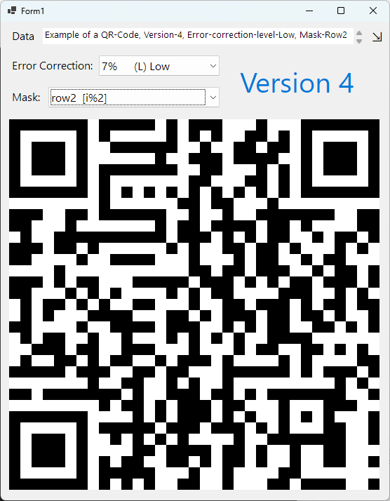
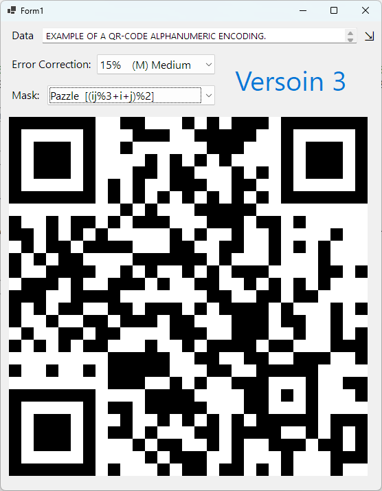
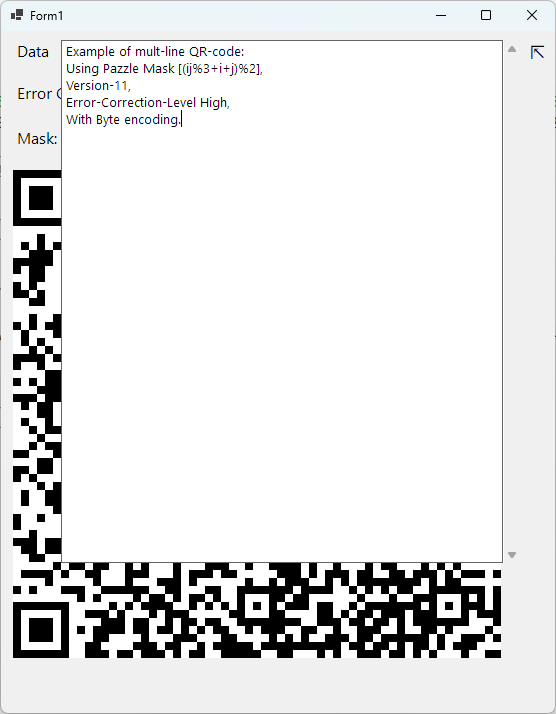
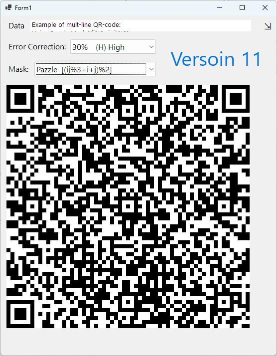

# QR-Code
<h2>This Project is a QR-Code generator<h2>

This QR-Code generator can generate the 40 versions of the QR-Protocol.
It works with the 7 different masks of the QR-Protocol, and has 4 encoding methods:
* Numeric - Only digits [0-9]
* Alphanumeric - Only digits & Upper-Case English letters [0-9 A-Z]
* Byte - The ASCII table (including English letters, digits, common characters, etc. )
* UTF-16 - All characters, this encoding method, doesn't work with common phones' scanners, because they don't support UTF-16 in QR-Protocol.

  
  
  
  

